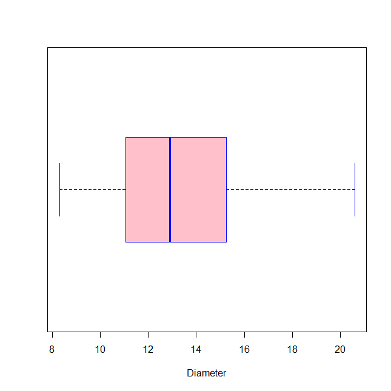
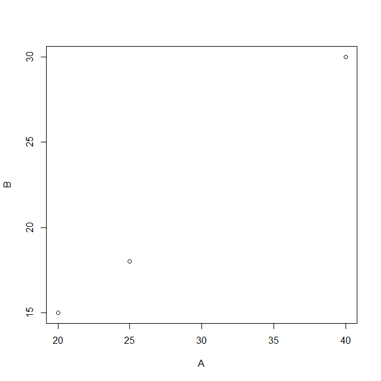
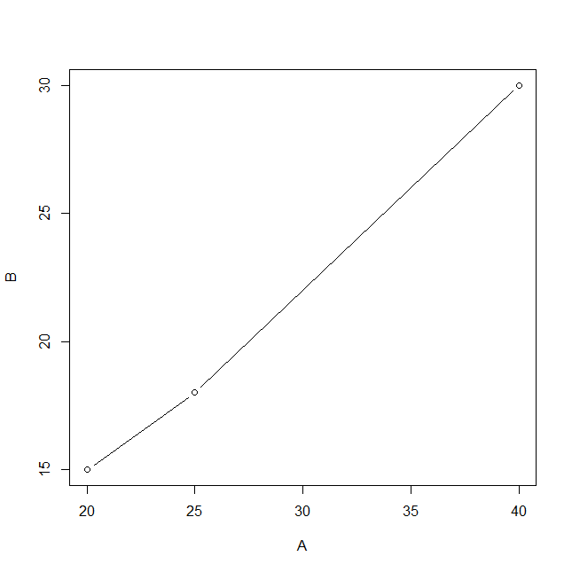
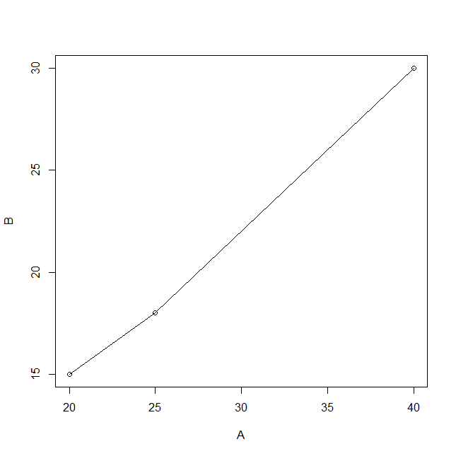
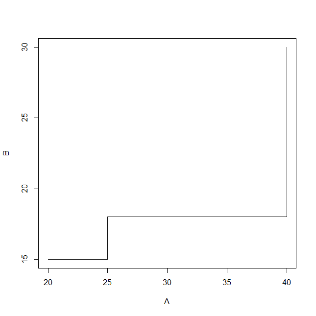
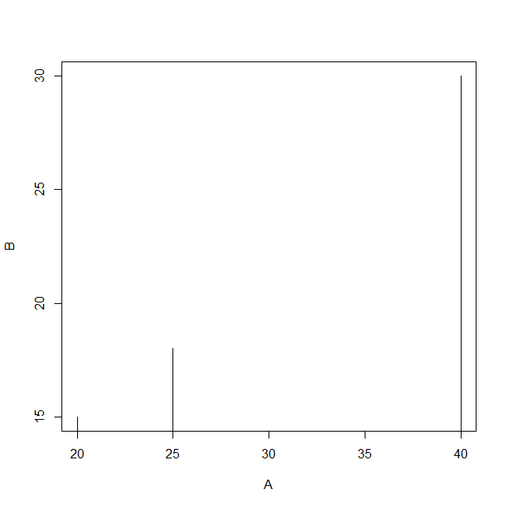
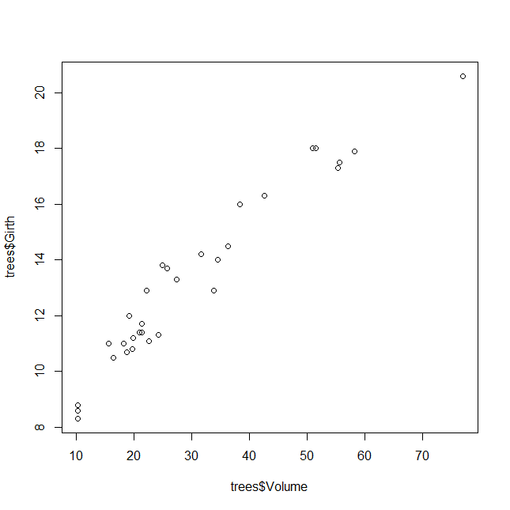
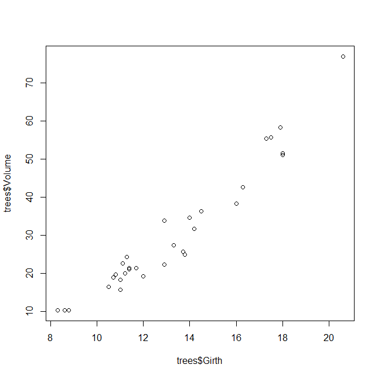
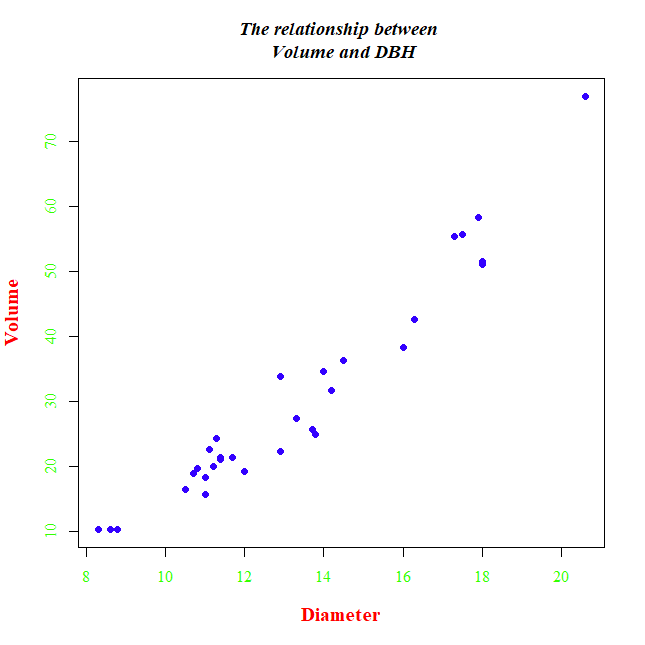

# 📊 Session 6 – Output Plots

This folder contains example plots generated in **Session 6** of the R learning series.   
Each plot demonstrates various R-based graphics techniques, including box plots, scatter plots, and styling options.

---
  
  ## 🟫 Boxplots
  
  ### 📌 Girth of Trees  
  

### 📌 Colored Boxplot of PlantGrowth Groups  

---
  
  ## 🧵 Plot Types Demonstration
  
  Each plot below shows a different `type =` option in R base `plot()`:
  
  - `type = "p"` (points)  

- `type = "l"` (lines)  

- `type = "b"` (both points and lines)  

- `type = "o"` (overplotted)  

- `type = "s"` (steps)  

- `type = "h"` (histogram-like lines)  

---
  
  ## 🧪 Scatter Plots and Styled Examples
  
  ### 📌 Scatter Plot – Volume vs. Girth  
  

### 📌 Scatter Plot – Girth vs. Volume  

### 🎨 Styled Plot with Labels, Colors, Fonts  

---
  
  > ✍️ *Generated with base R plotting functions + RColorBrewer + custom styles.*

  
  