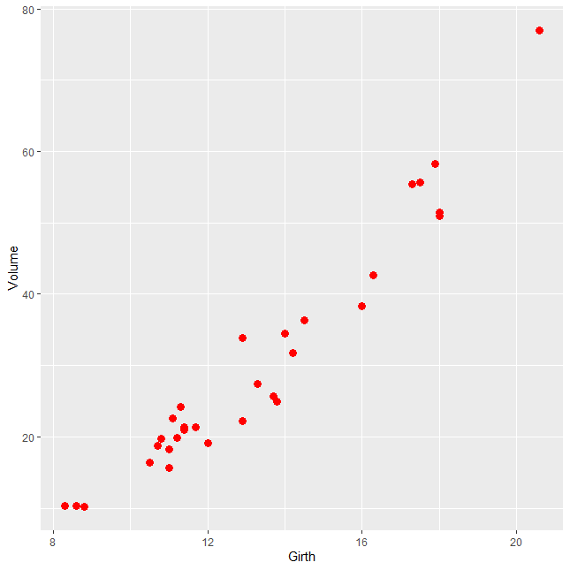

# 📊 Session 7: Advanced Plotting and Customization in R

This session covers advanced visualization techniques in R using `ggplot2`, base R, and custom aesthetic enhancements. Each file is a standalone example of a specific plotting technique or customization.

---

## 🖼️ Plot Previews

### 01 - Basic scatter plot with red points

### 02 - Scatter plot with axis labels only

### 03 - Scatter plot with axis labels and a custom title

### 04 - Scatter plot with point labels using `geom_label()`

### 05 - Bar chart with custom colors for species

### 06 - Bar plot with bold/italic title, left aligned

### 07 - Bar plot with custom X/Y axis text colors

### 08 - Boxplot with palette subset

### 09 - Boxplot with reordered categories

### 10 - Boxplot with legend positioned at top

### 11 - Boxplot with legend top-right

### 12 - Boxplot with red-colored legend title

### 13 - Boxplot with renamed legend title

### 14 - Boxplot with red outline including outliers

### 15 - Notched boxplot with outliers

### 16 - Boxplot using `theme_classic()`

### 17 - Boxplot using `theme_dark()`

### 18 - Color palette display (`RColorBrewer`)

---

## 🧰 Dependencies

Make sure to have the following R packages installed:
- `tidyverse`
- `RColorBrewer`

## 📦 Usage

Each plot is saved as an image to illustrate a specific aesthetic or structural modification. The `.R` script associated with these plots can be found in the `07-advanced-visualization.R` file.

---

> Prepared as part of **R Advanced Visualization Course**  
> 🔗 Repository: `R-learning-notes`

