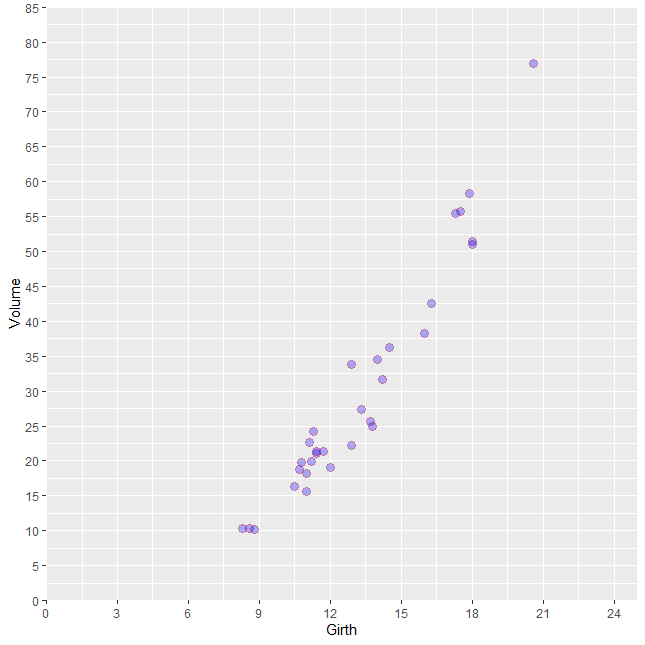

# 📊 Session 8: Advanced Boxplots and Scatterplots with Patterns and Themes

This session presents enhanced visualization techniques using `ggplot2`, `ggpattern`, `ggpubr`, `patchwork`, and `cowplot`.  
The focus is on customizing boxplots, bar plots, and scatterplots using patterns, group aesthetics, and theme variations.

---

## 📦 1. Bar Plot with Summary Stats  
Bar plot with mean and standard error bars.  

---

## 📦 2. Basic Boxplot  
A simple boxplot without group-specific aesthetics.  

---

## 🧩 3. Boxplot with Pattern  
Boxplot with `ggpattern` patterns applied per group.  

---

## 🎨 4. Custom Pattern and Color  
Boxplot with custom patterns and color fills.  

---

## 🌈 5. Pattern Transparency and Colors  
Adjusting transparency (alpha) and pattern fills.  

**Pattern aesthetics by group**  

---

## 🏷 6. Final Boxplot with Relabeled Group  
Modified group labels for clarity.  

---

## ➕ 7. Add Angle  
Rotated x-axis text labels for better readability.  

---

## ↔️ 8. Add Spacing  
Spacing adjustments between grouped bars or boxplots.  

---

## 📐 9. Mean with Error Bar  
Line plot of group means with standard error bars.  

---

## 🧮 10. Equation Label  
Display of regression equation on plot.  

---

## 🔄 11. Regression Line  
Add a fitted linear regression line using `geom_smooth()`.  

---

## 🔬 12. Correlation and Regression Line with ggpubr  
Scatterplot with correlation coefficient (r²) and regression line.  

---

## 📉 13. Scatterplots  
Basic scatterplots for visualizing bivariate data.  

---

## 🧩 14. Combine Plots (cowplot)  
Plot composition using `cowplot::plot_grid()`.  

---

## 🔗 15. Combine Plots (patchwork)  
Using `patchwork` to arrange multiple plots.  

---

## 🎨 16. theme_bw()  
White background with light gray grid lines.  

---

## 🎨 17. theme_classic()  
Classic theme with no background grid.  

---

## 🎨 18. theme_gdocs()  
Google Docs-like theme style.  

---

## 🎨 19. theme_light()  
Clean theme with subtle grid lines.  

---

## 🎨 20. theme_void()  
Minimal theme with no axes, ticks, or background.  

---

## 🎨 21. theme_wsj()  
Wall Street Journal-style plot theme.  

