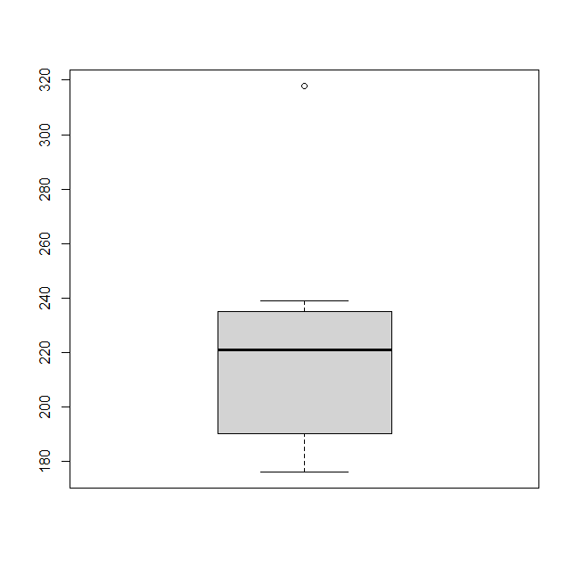
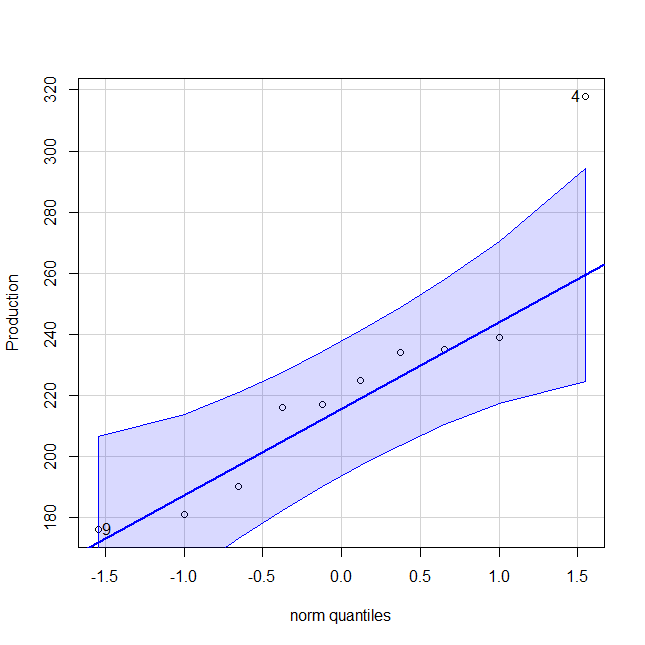
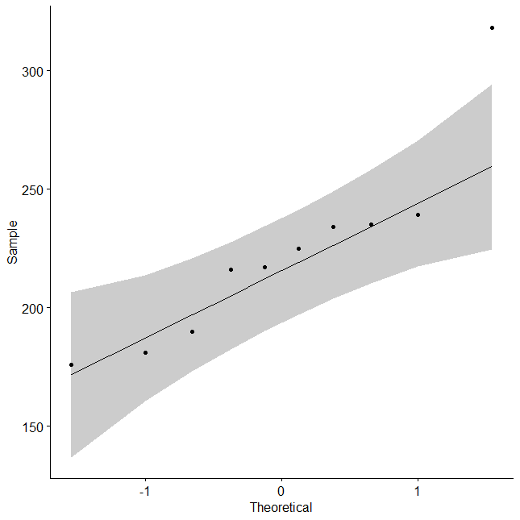

# 📊 Session 10: Normality and Distribution Plots

This session focuses on testing normality and distributional assumptions using boxplots and Q-Q plots. We visualize the distribution of the `Production` dataset and examine the presence of outliers or non-normal patterns.

---

## 📦 1. Boxplot of Production  
A classic boxplot to visualize central tendency, spread, and potential outliers.  

---

## 📐 2. Q-Q Plot (car::qqPlot)  
Base R Q-Q plot with confidence envelope, generated using the `car` package.  

---

## 🎨 3. Q-Q Plot (ggpubr::ggqqplot)  
A ggplot2-based Q-Q plot with shaded confidence area and outlier labels.  

