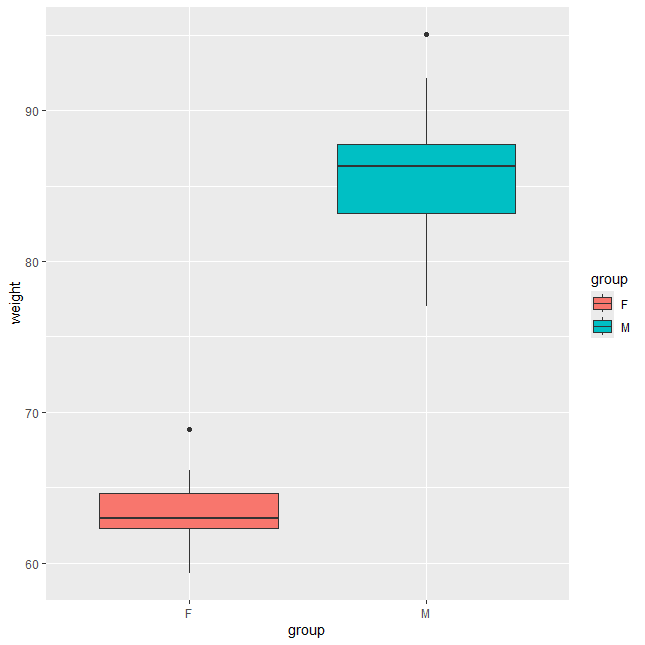
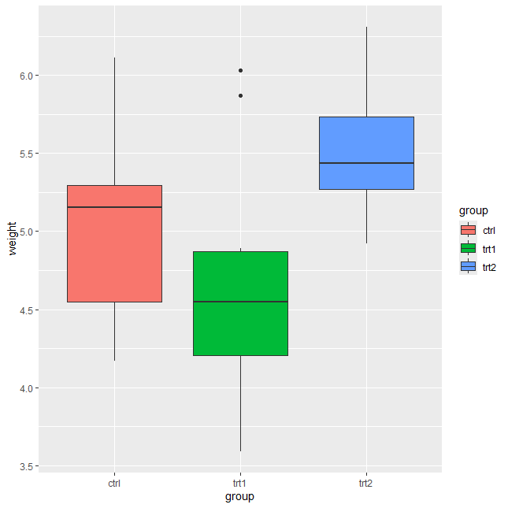
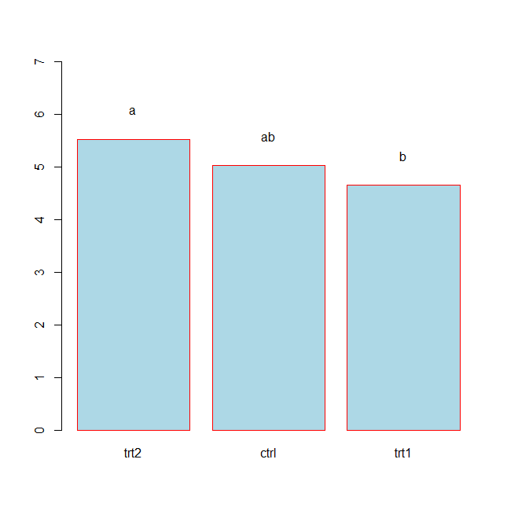
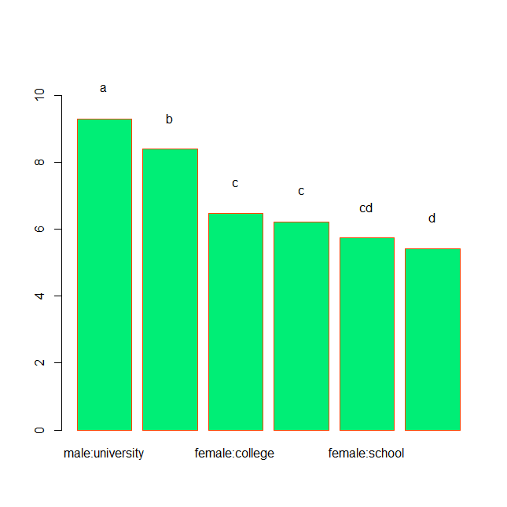
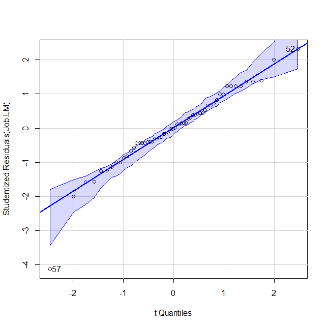

# 📊 Session 11: One-way and Two-way ANOVA with Visualization

This session focuses on performing one-way and two-way ANOVA (Analysis of Variance), validating assumptions, and visualizing group differences using post-hoc comparisons and residual diagnostics.

---

### 1. `geom_boxplot`

Boxplot comparing weight between two groups (`F`, `M`) using **ggplot2**.

- Shows medians, interquartile ranges, and outliers  
- Useful for visually checking distribution and spread  

---

### 2. `geom_boxplot_PlantGrowth`

Boxplot for `PlantGrowth` dataset comparing three treatment groups.  

- Visually displays variance between `ctrl`, `trt1`, and `trt2`  

---

### 3. `barplot_HSD_Results`

Barplot showing group means with compact letter display after post-hoc Tukey HSD test.

- Clear labels (`a`, `b`, `ab`) show which groups differ significantly  

---

### 4. `barplot_Job_AOV_HSD_groups`

Grouped barplot comparing job satisfaction across multiple education × gender combinations with post-hoc letters.

- Highlights pairwise differences across factor levels  

---

### 5. `qqPlot_Job_LM`

Q-Q plot of linear model residuals for normality assessment.  

- Residuals lie approximately along the diagonal line → normality assumption is met  

---

### 6. `barplot_Job_AOV_HSD_groups` *(duplicate plot label)*

Second instance of the same post-hoc grouped barplot – consider replacing or renaming if it’s a different version.

---

**Summary**: This session combines statistical testing (ANOVA) with visual diagnostics to ensure validity and interpretability of group comparisons.
